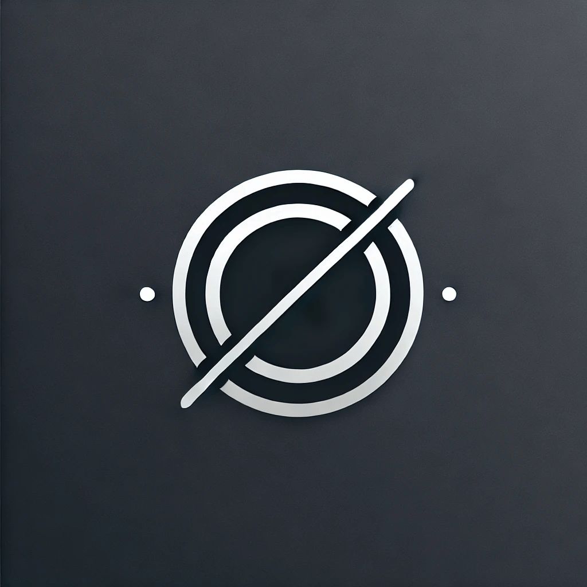

# Pulse

<p align="center">
  
</p>

Pulse is a personal focus + “mental exercise” app for Android: set an interval, work until the timer ends, then **physically acknowledge** (or admit a distraction) using the **hardware volume buttons**. It repeats forever until you stop it.

> Status: built for personal use. The core timer/volume-button flow is Android-first; other platforms in this repo are not feature-complete.

## Download

- GitHub Releases: publish `app-release.apk` and users can install it (no Flutter needed).
- Release guide: `RELEASING.md`

## Screenshots

<p align="center">
  
  
</p>
<p align="center">
  
  
</p>

## What it does

Pulse is an interval-based focus loop:

- Work for a fixed interval
- When time’s up, the phone vibrates until you respond
- Respond using volume buttons (**Up = acknowledge**, **Down = distraction**)
- Next interval starts immediately

It also has a **90s safety timeout** during vibration: if you don’t respond, the session auto-pauses.

## Highlights

- Infinite focus timer loop (run → vibrate → acknowledge/distract → repeat)
- Start / pause / resume / stop
- Notification controls (pause/resume/stop)
- Lock-screen “time’s up” screen (only when the device is locked)
- Simple stats dashboard:
  - today’s focus minutes
  - total focus minutes
  - current streak + longest streak
  - last 7 days bar chart
  - total distractions
- Remembers last used interval (SharedPreferences)
- Stores history locally on-device; no backend

## How to use

- While **running**: use the in-app buttons or the notification to pause/resume/stop.
- While **vibrating** (time’s up):
  - **Volume Up**: acknowledge (logs focus)
  - **Volume Down**: distracted (logs distraction)
  - (optional) Tap **Stop Focus** on the lock-screen screen

Android requires Accessibility Services to be enabled manually (the app can only deep-link you to the settings page).

## Run (development)

Prereqs:
- Flutter SDK (Dart `^3.10.7` per `pubspec.yaml`)
- Android Studio + an Android device/emulator

Run:

```bash
flutter pub get
flutter run
```

## Required Android setup

To use hardware volume buttons, enable the Accessibility Service:

**Settings → Accessibility → Pulse Controls**

## Privacy

- No accounts, no analytics, no network calls
- Focus history is stored locally on the device database

## Notes

- This is intentionally “hardware-y”, so the Android implementation uses a foreground service, vibration, and an accessibility service (only intercepting volume keys during the “time’s up” vibration phase).
- If you run into reliability issues on some devices, you may need to manually allow battery optimization exceptions.
